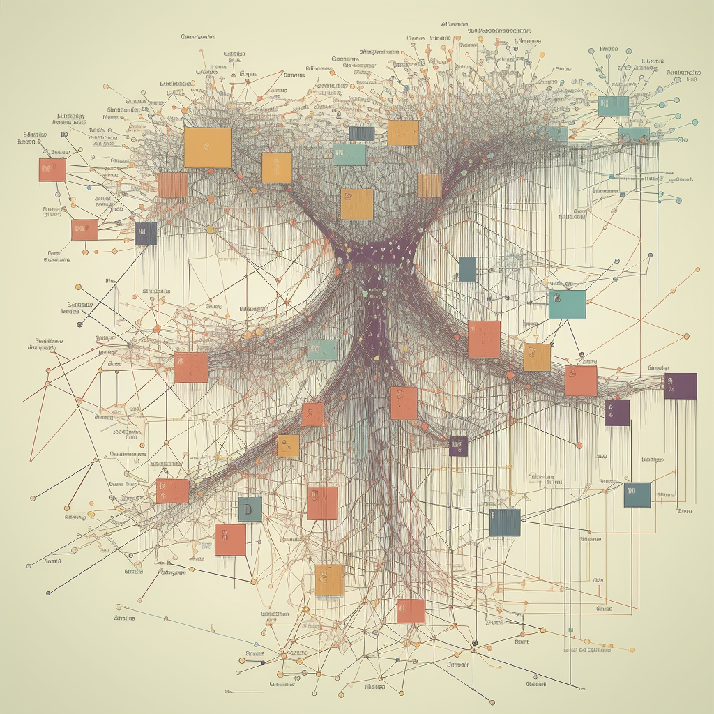

# not Secret

It is not a secret that frontend developers often lack on basic computer science knowledge such as data structures or algorithms. Even if you once knew of it, it is rare encountering a problem on the frontend that cannot be solved by someone else's library, hence you end up not trying to solve a problem and relying on a [black box](https://en.wikipedia.org/wiki/Black_box).

I'm not exempt from the previous statement. But I'm trying to change that!

_*created with [Midjourney](https://www.midjourney.com/)*_

# Boot.dev

I started taking the courses on [boot.dev](https://www.boot.dev/) about algorithms, data structures, and advanced algorithms. They have helped me a lot, the courses are gamified, interactable, and clear.

While going through them my favorite structure became the [Linked Lists](https://en.wikipedia.org/wiki/Linked_list), especially the LLQueue which is an implementation of a Queue with a Linked List, is very simple and straightforward and every functionality runs at O(1)!

After this, I'm going to be working through [The Primagen](https://twitter.com/ThePrimeagen)'s course on Frontend Masters: [The Last Algorithms Course You'll Need](https://frontendmasters.com/courses/algorithms/introduction/).

# Visualizer

I thought about creating a 3D gallery where you can go in and check how different algorithms and data structures work. It could be like a hall with rooms or a more dynamic scene.

Maybe a boat in the ocean and every island is a structure or an algorithm!

Anyway, I'll keep on learning and becoming better.  
Thanks for reading!
